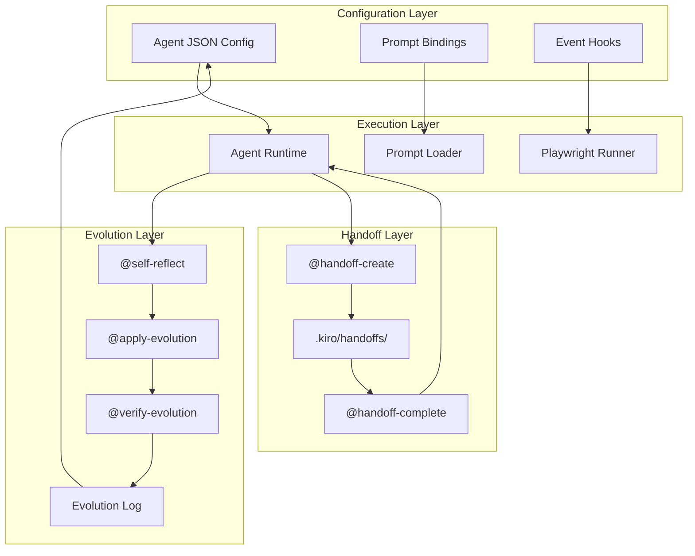

# Design Document: Agent-Prompt Integration System

## Overview

This design describes a comprehensive integration system that binds agents to prompts, enables automatic verification with Playwright, and creates a self-evolving feedback loop. The system transforms disconnected agents and prompts into a unified development platform where each session improves the overall system.

The architecture follows a layered approach:
1. **Configuration Layer** - Agent JSON configs with prompt bindings
2. **Execution Layer** - Runtime prompt invocation and verification
3. **Evolution Layer** - Self-reflection, improvement application, and rollback
4. **Handoff Layer** - Structured delegation between agents

## Architecture



## Components and Interfaces

### 1. Agent Configuration Schema

Extended agent JSON schema with prompt bindings:

```typescript
interface AgentConfig {
  name: string;
  description: string;
  prompt: string;
  model: string;
  tools: string[];
  allowedTools: string[];
  resources: string[];
  
  // NEW: Prompt bindings
  prompts: {
    onStart: string[];      // Prompts to run when session begins
    onComplete: string[];   // Prompts to run when task completes
    available: string[];    // Prompts agent can manually invoke
    autoTrigger: {
      afterWrite: string[]; // Prompts after file writes
      afterError: string[]; // Prompts after errors
    };
  };
  
  // NEW: Event hooks
  hooks: {
    postToolUse: Array<{
      matcher: string;      // Tool name to match (e.g., "write")
      command: string;      // Command to run
    }>;
  };
  
  toolsSettings: {
    read: { allowedPaths: string[] };
    write: { allowedPaths: string[] };
  };
}
```

### 2. Prompt Loader Interface

```typescript
interface PromptLoader {
  // Load a prompt by name from .kiro/prompts/
  load(promptName: string): Promise<PromptContent>;
  
  // Check if agent has access to prompt
  canInvoke(agentName: string, promptName: string): boolean;
  
  // Get all prompts for an event
  getForEvent(agentName: string, event: 'onStart' | 'onComplete'): string[];
  
  // Get auto-trigger prompts
  getAutoTrigger(agentName: string, trigger: 'afterWrite' | 'afterError'): string[];
}

interface PromptContent {
  name: string;
  content: string;
  metadata: {
    category: string;
    agents: string[];  // Which agents typically use this
  };
}
```

### 3. Playwright Verification Interface

```typescript
interface PlaywrightVerifier {
  // Run smoke tests (< 30 seconds)
  runSmokeTests(): Promise<TestResult>;
  
  // Run full test suite
  runFullSuite(): Promise<TestResult>;
  
  // Check if Playwright is available
  healthCheck(): Promise<HealthStatus>;
  
  // Take screenshot at viewport
  screenshot(url: string, viewport: Viewport): Promise<Buffer>;
}

interface TestResult {
  passed: boolean;
  duration: number;
  failures: TestFailure[];
  summary: string;
}

interface TestFailure {
  testName: string;
  error: string;
  screenshot?: string;
}

type Viewport = 'mobile' | 'tablet' | 'desktop' | 'large';
```

### 4. Evolution System Interface

```typescript
interface EvolutionSystem {
  // Analyze session and generate improvements
  reflect(session: SessionContext): Promise<RBTAnalysis>;
  
  // Apply high-confidence improvements
  applyEvolution(agentName: string, patch: AgentPatch): Promise<ApplyResult>;
  
  // Verify evolution didn't cause regression
  verifyEvolution(agentName: string, testTask: string): Promise<VerifyResult>;
  
  // Rollback if regression detected
  rollback(agentName: string, previousConfig: AgentConfig): Promise<void>;
}

interface RBTAnalysis {
  roses: string[];      // What worked well
  buds: string[];       // Opportunities
  thorns: string[];     // Failures
  proposedChanges: ProposedChange[];
}

interface ProposedChange {
  type: 'prompt_addition' | 'tool_change' | 'resource_addition';
  description: string;
  patch: object;
  confidence: number;   // 1-10
}

interface ApplyResult {
  success: boolean;
  appliedChanges: ProposedChange[];
  skippedChanges: ProposedChange[];
  backupPath: string;   // Path to backup config
}
```

### 5. Handoff Protocol Interface

```typescript
interface HandoffProtocol {
  // Create a handoff for delegation
  create(params: HandoffParams): Promise<HandoffFile>;
  
  // Read a handoff as the receiving agent
  read(handoffPath: string): Promise<HandoffContent>;
  
  // Complete a handoff with results
  complete(handoffPath: string, results: HandoffResults): Promise<void>;
  
  // Check for circular delegation
  validateChain(chain: string[]): boolean;
}

interface HandoffParams {
  fromAgent: string;
  toAgent: string;
  task: string;
  fileRefs: string[];
  expectedOutput: string;
  successCriteria: string[];
}

interface HandoffFile {
  path: string;         // .kiro/handoffs/[timestamp]-[agent]-[task].md
  content: HandoffContent;
}

interface HandoffContent {
  metadata: {
    timestamp: string;
    fromAgent: string;
    toAgent: string;
    delegationChain: string[];
  };
  task: string;
  fileRefs: string[];
  expectedOutput: string;
  successCriteria: string[];
  results?: HandoffResults;
}

interface HandoffResults {
  status: 'success' | 'partial' | 'failed';
  summary: string;
  filesModified: string[];
  notes: string;
}
```

## Data Models

### Agent Prompt Bindings (per agent)

| Agent | onStart | onComplete | available | autoTrigger.afterWrite | autoTrigger.afterError |
|-------|---------|------------|-----------|------------------------|------------------------|
| orchestrator | ["prime"] | ["self-reflect"] | ["plan-feature", "next-task", "workflow-status", "handoff-create"] | [] | ["rca"] |
| code-surgeon | [] | ["self-reflect"] | ["code-review", "security-audit", "rca"] | ["code-review-fix"] | ["rca"] |
| test-architect | [] | ["self-reflect"] | ["test-coverage"] | [] | ["rca"] |
| frontend-designer | [] | ["self-reflect", "verify-changes"] | ["ui-review", "a11y-audit", "responsive-check"] | ["verify-changes"] | ["rca"] |
| db-wizard | [] | ["self-reflect"] | ["db-optimize"] | [] | ["rca"] |
| doc-smith | [] | ["self-reflect"] | [] | [] | [] |
| devops-automator | [] | ["self-reflect"] | ["deploy-checklist"] | [] | ["rca"] |

### Handoff File Format

```markdown
# Handoff: [Task Name]

## Metadata
- **Timestamp**: 2026-01-12T15:30:00Z
- **From**: orchestrator
- **To**: code-surgeon
- **Delegation Chain**: [orchestrator]

## Task
[Detailed task description]

## File References
- `app/api/profiles/route.ts`
- `lib/services/profile-service.ts`

## Expected Output
[What the receiving agent should produce]

## Success Criteria
- [ ] Criterion 1
- [ ] Criterion 2

## Results
<!-- Filled by receiving agent -->
**Status**: [success|partial|failed]
**Summary**: [Brief summary]
**Files Modified**: [List]
**Notes**: [Any additional notes]
```

### Evolution Log Entry Format

```markdown
## Session: 2026-01-12 - [Task Description]

### Context
- **Agent**: code-surgeon
- **Project**: tuberank
- **Duration**: ~25 minutes

### RBT Analysis

#### 🌹 Roses
- [What worked well]

#### 🌱 Buds
- [Opportunities identified]

#### 🌵 Thorns
- [Failures encountered]

### Proposed Changes

#### Change 1: [Description]
- **Type**: prompt_addition
- **Confidence**: 9
- **Patch**:
```json
{
  "prompts.available": ["code-review", "security-audit", "rca", "NEW_PROMPT"]
}
```

### Applied
- [x] Change 1 (confidence 9)
- [ ] Change 2 (confidence 6 - flagged for review)
```


## Correctness Properties

*A property is a characteristic or behavior that should hold true across all valid executions of a system—essentially, a formal statement about what the system should do. Properties serve as the bridge between human-readable specifications and machine-verifiable correctness guarantees.*

Based on the prework analysis, the following properties have been identified after eliminating redundancy:

### Property 1: Agent Config Schema Validation
*For any* agent configuration JSON, the config SHALL contain a valid `prompts` object with `onStart` (array), `onComplete` (array), `available` (array), and `autoTrigger` (object with `afterWrite` and `afterError` arrays).
**Validates: Requirements 1.1**

### Property 2: Event-Triggered Prompt Invocation
*For any* agent with configured event triggers (onStart, onComplete, afterWrite, afterError), when the corresponding event occurs, ALL prompts listed for that event SHALL be invoked in order.
**Validates: Requirements 1.2, 1.3, 1.4, 1.5**

### Property 3: Available Prompts Accessibility
*For any* agent and any prompt listed in its `available` array, the prompt SHALL be loadable and invocable by that agent.
**Validates: Requirements 1.6**

### Property 4: File Writes Trigger Verification
*For any* agent with `autoTrigger.afterWrite` configured, when the agent writes a code file, the smoke test command SHALL be executed.
**Validates: Requirements 2.2**

### Property 5: Test Failures Trigger RCA
*For any* test failure during verification, the @rca prompt SHALL be invoked to diagnose the failure.
**Validates: Requirements 2.4**

### Property 6: Self-Reflect Produces Valid RBT Structure
*For any* session context passed to @self-reflect, the output SHALL contain valid `roses`, `buds`, `thorns` arrays and a `proposedChanges` array where each change has `type`, `description`, `patch`, and `confidence` (1-10).
**Validates: Requirements 3.1**

### Property 7: Evolution Application Produces Valid Patches
*For any* proposed change with confidence >= 8, the @apply-evolution prompt SHALL generate a valid JSON patch that can be applied to the agent config without breaking the schema.
**Validates: Requirements 3.3**

### Property 8: Regression Triggers Rollback
*For any* evolution that causes test failures during @verify-evolution, the system SHALL automatically rollback to the previous agent config.
**Validates: Requirements 3.5**

### Property 9: Evolution Changes Are Logged
*For any* evolution change applied (regardless of success or rollback), an entry SHALL be appended to DEVLOG.md with timestamp, agent name, change description, and outcome.
**Validates: Requirements 3.6**

### Property 10: Handoff Creation Produces Valid Files
*For any* delegation from one agent to another, a handoff file SHALL be created at `.kiro/handoffs/[timestamp]-[agent]-[task].md` containing: metadata (timestamp, fromAgent, toAgent, delegationChain), task, fileRefs, expectedOutput, and successCriteria.
**Validates: Requirements 4.1, 4.2**

### Property 11: Handoff Completion Updates File
*For any* completed handoff, the handoff file SHALL be updated with a `results` section containing: status (success|partial|failed), summary, filesModified, and notes.
**Validates: Requirements 4.4**

### Property 12: Circular Delegation Prevention
*For any* delegation chain, if the target agent already appears in the chain, the delegation SHALL be rejected with an error.
**Validates: Requirements 4.6**

### Property 13: Agent Configs Have Correct Bindings
*For any* of the seven agents (orchestrator, code-surgeon, test-architect, frontend-designer, db-wizard, doc-smith, devops-automator), the config SHALL contain the prompt bindings specified in the requirements.
**Validates: Requirements 6.1, 6.2, 6.3, 6.4, 6.5**

### Property 14: Execution Loop Order
*For any* agent execution with the full loop enabled, the steps SHALL execute in order: prime → execute → verify-changes → self-reflect → apply-evolution → verify-evolution.
**Validates: Requirements 7.1**

### Property 15: Confidence Scoring Determines Action
*For any* proposed change:
- If confidence >= 8: change SHALL be auto-applied
- If confidence is 5-7: change SHALL be flagged for review (not auto-applied)
- If confidence is 1-4: change SHALL be documented only (not applied)
**Validates: Requirements 7.2, 7.3, 7.4**

### Property 16: Evolutions Persist Across Sessions
*For any* evolution successfully applied and verified, the next agent session SHALL start with that evolution active in the config.
**Validates: Requirements 7.6**

## Error Handling

### Configuration Errors

| Error | Handling |
|-------|----------|
| Invalid agent config schema | Reject config load, log validation errors, use default config |
| Missing prompt file | Log warning, skip prompt invocation, continue execution |
| Invalid prompt binding | Log error, remove invalid binding, continue with valid bindings |

### Execution Errors

| Error | Handling |
|-------|----------|
| Prompt invocation fails | Log error, invoke @rca if configured, continue execution |
| Playwright not available | Log warning, skip verification, suggest installation |
| Smoke tests timeout (>30s) | Kill tests, log timeout, flag for investigation |
| Test failures | Invoke @rca, block further execution until resolved |

### Evolution Errors

| Error | Handling |
|-------|----------|
| Invalid JSON patch | Reject patch, log error, do not apply |
| Config write fails | Rollback to backup, log error, alert user |
| Verification fails post-evolution | Auto-rollback, log regression, mark evolution as failed |
| Evolution log write fails | Continue execution, log to console, retry on next session |

### Handoff Errors

| Error | Handling |
|-------|----------|
| Circular delegation detected | Reject delegation, return error to originating agent |
| Handoff file creation fails | Log error, attempt inline delegation, alert user |
| Receiving agent not found | Return error, suggest available agents |
| Handoff timeout | Mark as failed, return partial results if available |

## Testing Strategy

### Dual Testing Approach

This system requires both unit tests and property-based tests:

- **Unit tests**: Verify specific examples, edge cases, and integration points
- **Property tests**: Verify universal properties across all valid inputs

### Property-Based Testing Configuration

- **Library**: fast-check (TypeScript property-based testing)
- **Minimum iterations**: 100 per property test
- **Tag format**: `Feature: agent-prompt-integration, Property N: [property text]`

### Test Categories

#### 1. Schema Validation Tests (Properties 1, 13)
- Generate random agent configs
- Validate schema compliance
- Test edge cases (empty arrays, missing fields)

#### 2. Event Trigger Tests (Properties 2, 4, 5)
- Mock event emission
- Verify correct prompts are invoked
- Test ordering guarantees

#### 3. Evolution System Tests (Properties 6, 7, 8, 9, 15, 16)
- Generate random session contexts
- Validate RBT output structure
- Test confidence thresholds
- Verify rollback behavior
- Test persistence across sessions

#### 4. Handoff Protocol Tests (Properties 10, 11, 12)
- Generate random handoff params
- Validate file creation and format
- Test circular delegation detection
- Verify completion updates

#### 5. Integration Tests (Property 14)
- Test full execution loop order
- Verify step dependencies
- Test error recovery

### Smoke Test Suite Requirements

The smoke test suite (`tests/e2e/smoke.spec.ts`) must:
- Complete in under 30 seconds
- Cover: homepage load, card creation, kanban drag-drop
- Use @smoke tag for filtering
- Run on every file write via hooks

### Test File Structure

```
tests/
├── unit/
│   ├── agent-config.test.ts      # Property 1, 13
│   ├── prompt-loader.test.ts     # Property 3
│   ├── evolution-system.test.ts  # Properties 6, 7, 8, 9, 15, 16
│   └── handoff-protocol.test.ts  # Properties 10, 11, 12
├── integration/
│   ├── event-triggers.test.ts    # Properties 2, 4, 5
│   └── execution-loop.test.ts    # Property 14
└── e2e/
    └── smoke.spec.ts             # Playwright smoke tests
```
